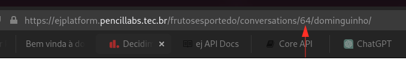
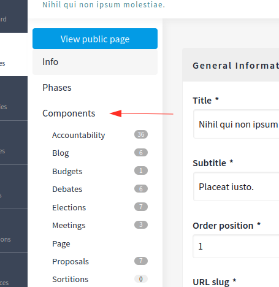
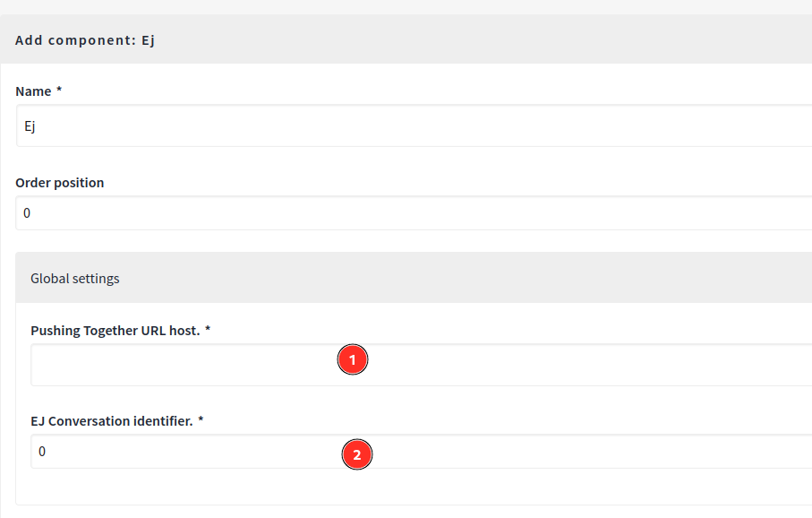
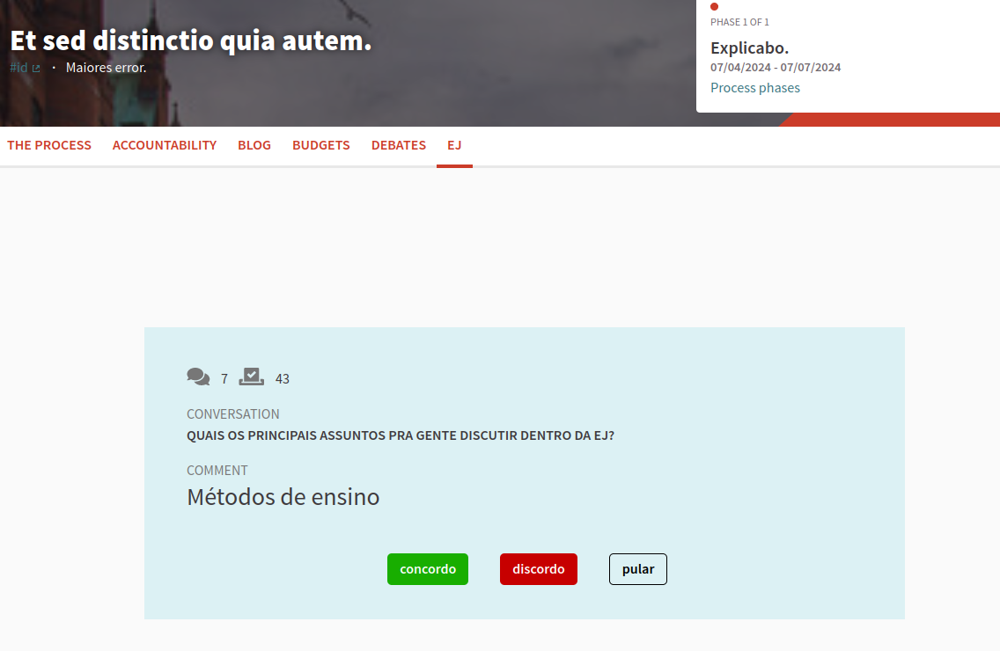

EJ component extends Decidim's capabilities to allow it to collect users opinions. After
enabling and configuring the component, a participation page will be available. 
The voting system is composed of a subject, a list of comments about the subject and 
three vote options. The votes are send to EJ using its API.

# Installation

Add this line to your application's Gemfile:
```ruby
gem "decidim-ej"
```

And then execute:
```bash
bundle
```

For local development, you can refer to [this repository](https://gitlab.com/pencillabs/brasilparticipativo/decidim-ej-site).

# Usage

1. Creates an EJ conversation.


2. Retrieves the conversation ID from URL. Keep this information.



3. Edit some Decidim participatory space and click on 'Components'.



4. Click on 'add components' and then click on EJ component.


5. Configure EJ component to request the conversation created on step 1.

- The host URL is the http/https EJ URL. This can be a local or remote EJ instance.
- The conversation identifier is the ID from step 2.

Now, you can save the component and it will appear on participatory space components list.



6. On components list, click on EJ component name. Decidim will load the participation page
for the configured conversation.



